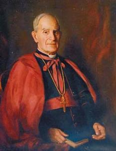

# Il-Poeżija ta' Dun Karm Psaila

[Dun Karm Psaila](https://en.wikipedia.org/wiki/Dun_Karm_Psaila), il-poeta nazzjonali tal-gżejjer Maltin, kiteb numru kbir ta' poeżiji u innijiet bil-lingwa Maltija, fosthom ovvjament L-Innu Malti. Dawn jinsabu miġbura fil-ktieb [_Dun Karm: Il-Poeżiji Miġbura_](https://bdlbooks.com/product/dun-karm-poezija-migbura/) ikkompilat minn Prof. Oliver Friggieri.

L-iskop ta' dan il-proġett huwa li jagħmel il-korp tax-xogħol ta' Dun Karm aċċessibbli fuq l-internet.
